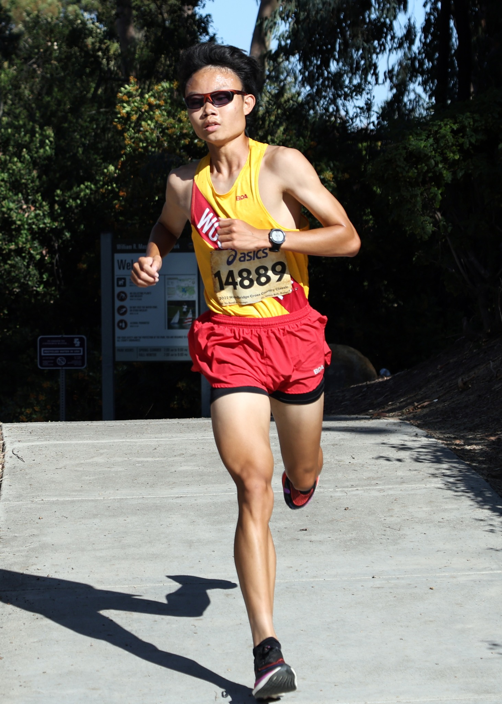

# Han's User Page

## Welcome

Hello, welcome to my user page! My name is Han, and I am a second-year student here at UCSD, majoring in both Computer Science and Mathematics.


## Programming

I first got interested in programming in fifth grade after taking a summer class, where I was introduced to [__Scratch__](http://scratch.mit.edu/). In high school, I developed two games on Roblox, one a magic PvP fighting game, and the other a prop hunt type game. Although both were ultimately unsuccessful on the platform, they greatly expanded my knowledge in several aspects of software development and furthered my interest in the field of computer science. Here's a tiny snippet of Roblox Lua code:

```
script.Parent.Touched:Connect(function(part)
    local humanoid = part.Parent:FindFirstChildOfClass("Humanoid")
    if humanoid then
        humanoid:TakeDamage(10)
    end
end)
```

CSE 110 will be my first time doing a group project, and I look forward to learning how to collaborate with my peers.

## Running

Besides being a programmer, I enjoy running in my free time. I have ran cross country and track all four years of high school. Here is a list of my PRs, which can be found on the [Records page](records.md):

- <ins>3 Miles:</ins> 15:21.3
- <ins>3200m:</ins> 9:54.36
- <ins>1600m:</ins> 4:26.96
- <ins>800m:</ins> 2:03.94

Now that I'm in college, I have continued to run recreationally. My goal this quarter is to stay consistently running ~~75~~ 70 miles per week and _maybe_ beat some of my high school times (under the condition that I am staying healthy by drinking plenty of H<sub>2</sub>O and having good sleep as my 1<sup>st</sup> priority). The plan I am following is James Copeland's Norwegian Singles Method, where the week consists of:

1. Easy Run
2. Sub-Threshold
3. Easy Run
4. Sub-Threshold
5. Easy Run
6. Sub-Threshold
7. Long Run

Notice that instead of having two hard workouts, there are three moderately hard ones. The idea is as follows:

> ...you might have two full pies a week, or you could have 85% of 3 pies.



### Finished reading everything?

- [ ] Welcome Section ([Link](#welcome))
- [ ] Programming Section ([Link](#programming))
- [ ] Running Section ([Link](#running))
- [ ] Records Page ([Link](records.md))